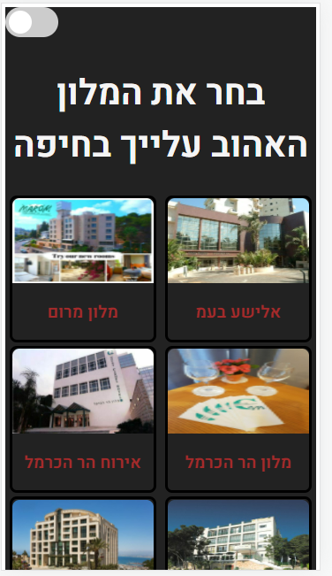
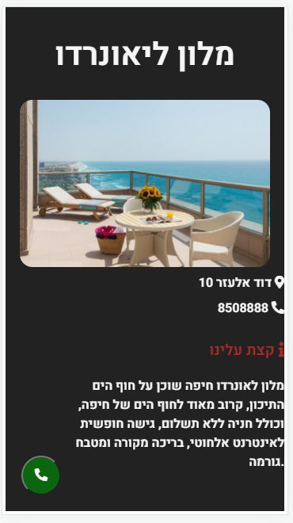
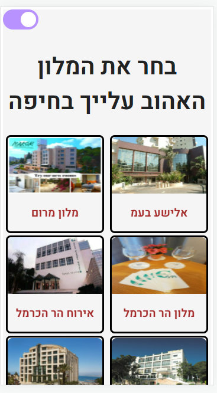
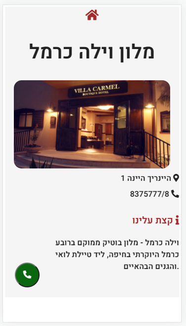

# Hotels-in-Heifa

---

### Front App with React Routers and React Context

### My GitHub-page - https://ramabadash.github.io/Hotels-in-Heifa/

### Getting started -

- **Clone this repo**
- **Run in terminal-** `cd hotels-in-heifa` -> `npm i` -> `npm start`

### Features -

- **Light / Dark mode**
- **Fit to mobile!**
- **Call now button**

---

### **My app:**

---

#### Assignment

- [x] You are going to build a simple hotels-app using data taken from Hotels in Haifa

1. [x] convert & modify csv to json string, so you can use it in your app for routing
2. [x] create new react project using CRA (`npx create-reacp-app hotels-app`)
3. [x] design & implement `HotelsGallery`,`HotelCard`,`HotelPage`, `CallNowButton` class components
4. [x] use `react-router-dom` to provide the following routes: '/' - homepage, '/hotelName' - in hebrew, kebab-case,

##### **Bonus Features:**

- [x] call now button will make a dial (when used by phone)
- [x] the hotel-cards gallery is scrollable
- [x] toggle button will switch between dark-theme and light-theme (using Context)

##### **Exemple-pic:**

