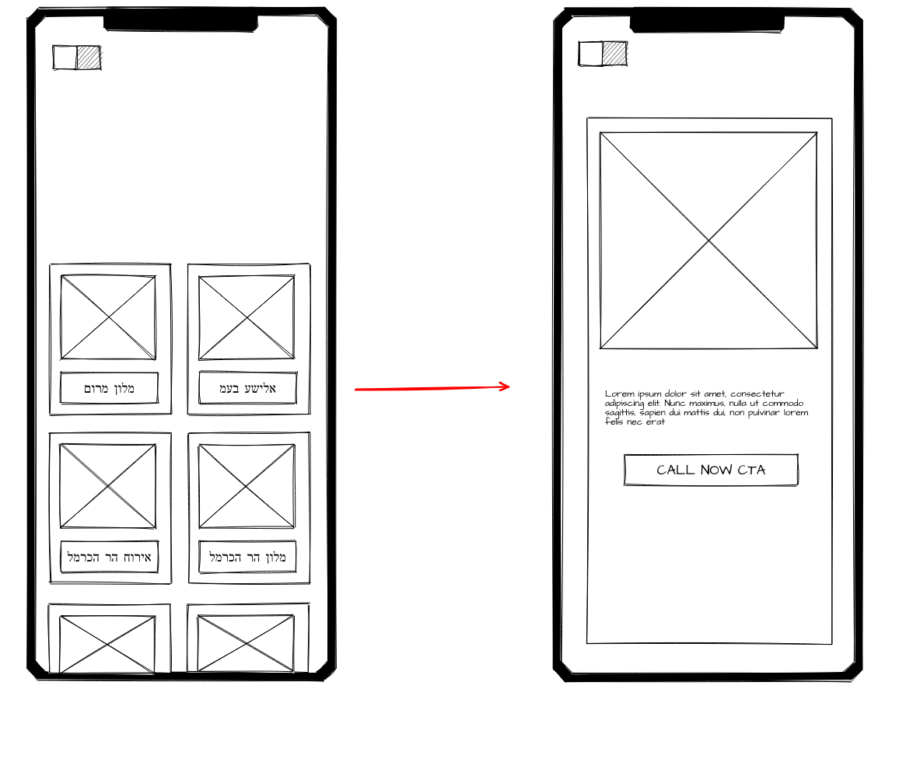

# Hotels-in-Heifa

### Assignment

- You are going to build a simple hotels-app using data taken from Hotels in Haifa

1. convert & modify csv to json string, so you can use it in your app for routing
2. create new react project using CRA (npx create-reacp-app hotels-app)
3. design & implement HotelsGallery,HotelCard,HotelPage, CallNowButton class components
4. use react-router-dom to provide the following routes: '/' - homepage, '/hotelName' - in hebrew, kebab-case,

#### **Bonus Features:**

- call now button will make a dial (when used by phone)
- the hotel-cards gallery is scrollable
- toggle button will switch between dark-theme and light-theme (using Context)

